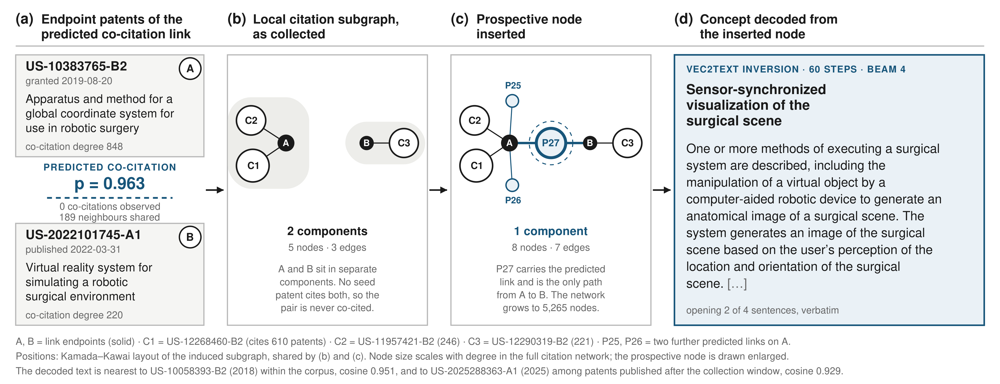

# Prospective technology concepts from predicted co-citation links

Data and code accompanying the manuscript on generating *prospective technology
concepts* in natural language from the **structure** of a patent co-citation
network, without reading the text of the patents at inference time.

The pipeline (1) predicts co-citation links that do not yet exist, (2) inserts each
predicted link into the citation network as a *prospective node*, (3) embeds that
node with a text-initialised graph attention network, (4) projects the graph
embedding into the text-embedding space with a ridge + residual-MLP projector, and
(5) inverts the projected vector into text with vec2text. The concepts are then
screened by a three-model agent-as-a-judge and matched against patents published
after the study period.



## Study at a glance

| Item | Value | Where to check |
|---|---:|---|
| Seed patents (Google Patents query on haptics x robot, US, filed 2020-2023) | 201 | `data/raw/collected_data_abstract_with_citation.csv` |
| Cited patents referenced by the seeds | 5,601 | `data/raw/Cited_patent_data.csv` |
| Co-citation network (association strength, largest component) | 5,090 nodes / 1,392,858 edges | `data/networks/cocitation_before_edges.csv.gz` |
| Directed citation network | 5,210 nodes / 6,353 edges | `data/networks/directed_citation_network_filtered.gexf` |
| Predicted co-citation links = prospective nodes | 55 | `data/predicted_new_links.csv` |
| Citation network after insertion | 5,265 nodes / 6,463 edges | `data/networks/network_with_prospective_nodes.gexf` |
| Generated technology concepts | 55 | `data/final_decoded_results.csv`, `data/prospective_nodes_grammar_corrected.xlsx` |
| Concepts passing all criteria of all three judges | 36 / 55 | `data/agentjudge_3model_combined.xlsx` |
| ... of which Top-1 cosine >= 0.90 to a patent published 2024 or later | 20 | `data/similarity_original_vs_corrected_2024plus.xlsx`, `tables/AppendixB_concepts_over_0.90.xlsx` |
| Predicted links that recombine different CPC main groups | 46 / 55 | `tables/table2_recombination.csv` |

Every number in this table is recomputed from the shipped files by one script:

```bash
python src/verify_reported_numbers.py
```

It runs offline in about a minute and prints each value next to the figure quoted
in the manuscript.

## Repository layout

```
.
├── README.md                 this file
├── data/                     inputs, networks, and every result file (see data/README.md)
│   ├── raw/                  seed patents, cited patents, subsequent-patent validation set
│   ├── networks/             co-citation and citation networks before/after prediction
│   └── *.csv | *.xlsx        predicted links, embeddings of the 55 prospective nodes,
│                             generated concepts, judge verdicts, similarity results, baselines
├── tables/                   tables as they appear in the manuscript (Table 1, 2, B.1, Appendix B)
├── figures/                  manuscript figures and exploratory plots (see figures/README.md)
├── src/                      analysis code, ordered by pipeline stage (see src/README.md)
│   ├── 00_data_acquisition/  clean-up of the Google Patents / BigQuery exports
│   ├── 01_network_construction/
│   ├── 02_link_prediction/
│   ├── 03_embedding/
│   ├── 04_cross_modal_alignment/
│   ├── 05_concept_generation/
│   ├── 06_evaluation/        judges, subsequent-patent matching, baselines, ablations
│   ├── 07_analysis/          CPC recombination analysis (Table 2)
│   ├── 08_figures/           figure scripts
│   └── verify_reported_numbers.py
├── scripts/                  helper shell scripts (unpack data, publish)
├── requirements.txt
└── .env.example              names of the API-key environment variables
```

## Data

`data/README.md` is the data dictionary: one entry per file with its origin, row
count, and columns. In short:

* **Raw inputs** – the 201 seed patents with their cited-patent lists, the metadata
  of the 5,601 cited patents (title, abstract, publication date, CPC codes), and the
  120 subsequent patents used for validation.
* **Networks** – the co-citation and citation networks before and after link
  prediction, as GEXF (gzipped where large) and as plain edge lists. Prediction
  results are carried as edge attribute `link_status` and node attribute `type`.
* **Results** – predicted links with probabilities, the projected embeddings of
  the 55 prospective nodes, the raw and grammar-corrected concept texts, the
  per-model agent-as-a-judge verdicts with rationales, cosine similarities to the
  subsequent patents, and the outputs of every baseline, ablation, and
  post-processing check reported in the manuscript.

Large intermediates that are regenerated by the pipeline are **not** included
(full text-embedding matrices of about 200 MB, GAT node-embedding matrices of about
300 MB, trained projector weights). They are listed at the end of `data/README.md`
and can be provided on request.

The two co-citation GEXF files and the two co-citation edge lists are gzipped. The
verification script reads them as they are; the pipeline scripts expect the
uncompressed names, so run `scripts/unpack_data.sh` once before using those.

## Reproducing the pipeline

### Environment

Python 3.12, CUDA 12.1 GPU with 16 GB or more for stages 3 to 5. Stage 1, 2, 6, 7,
8 run on CPU.

```bash
python -m venv .venv && source .venv/bin/activate
pip install torch==2.3.0 --index-url https://download.pytorch.org/whl/cu121
pip install torch-geometric==2.7.0
pip install -r requirements.txt
cp .env.example .env      # add keys
set -a; source .env; set +a
scripts/unpack_data.sh
```

API keys are read from environment variables only (`OPENAI_API_KEY`,
`ANTHROPIC_API_KEY`, `GOOGLE_API_KEY`). No key appears in the source.

### Stages and scripts

Scripts take no arguments; each reads its inputs from and writes its outputs to
`data/`, `tables/`, or `figures/` relative to the repository root, so they can be
launched from any working directory.

| Stage | Script | Input | Output | Needs |
|---|---|---|---|---|
| 1 Network construction | `src/01_network_construction/01_build_cocitation_network.py` | seed patents | `networks/patent_co_citation_network_filtered.gexf` | CPU |
| | `src/01_network_construction/02_build_citation_network.py` | seed patents | `networks/directed_citation_network_filtered.gexf` | CPU |
| 2 Link prediction | `src/02_link_prediction/01_link_prediction_gcn_xgboost.py` | co-citation GEXF | `predicted_new_links.csv` | GPU helps |
| | `src/02_link_prediction/02_insert_predicted_links_cocitation.py` | GEXF + links | `networks/co_citation_network_with_predicted_links.gexf` | CPU |
| | `src/02_link_prediction/03_insert_prospective_nodes_citation.py` | citation GEXF + links | `networks/network_with_prospective_nodes.gexf` | CPU |
| 3 Embedding | `src/03_embedding/01_text_embedding_openai_ada.py` | seed + cited patents | `text_embeddings_ada.csv` | OpenAI |
| | `src/03_embedding/03_graph_embedding_gat.py` | citation GEXF + text embeddings | `node_embeddings_with_text_embedding_ada.csv` | GPU |
| 4 Alignment | `src/04_cross_modal_alignment/01_ridge_residual_alignment.py` | node + text embeddings | `prospective_node_projected_embeddings_deep_mlp_ada.csv` | GPU |
| 5 Concept generation | `src/05_concept_generation/01_vec2text_decoding.py` | projected embeddings | `final_decoded_results.csv`, `..._with_nn.csv` | GPU + OpenAI |
| | `src/05_concept_generation/02_grammar_correction.py` | decoded concepts | `prospective_nodes_grammar_corrected.xlsx` | OpenAI |
| 6 Evaluation | `src/06_evaluation/01_subsequent_patent_similarity.py` | concepts + validation set | `prospective_*_similarity_*.xlsx` | CPU |
| | `src/06_evaluation/04_agent_as_a_judge_multimodel.py` then `05_agent_judge_combine.py` | corrected concepts | `agentjudge_3model_*.xlsx` | OpenAI, Anthropic, Google |
| | `src/06_evaluation/06..09_*` | concepts, links, embeddings | head-to-head and ablation CSVs | OpenAI |
| | `src/06_evaluation/10..12_postproc_*` | raw vs corrected concepts | `postproc_*.csv` | 12 needs OpenAI |
| 7 Analysis | `src/07_analysis/01_recombination_cpc.py` then `02_table2_recombination.py` | links + CPC codes + edge list | `tables/table2_recombination.*` | CPU |
| 8 Figures | `src/08_figures/*` | networks, layouts, results | `figures/*` | CPU |

`src/README.md` describes every script, its hyper-parameters, and the file it was
derived from in the working repository.

### Models and settings used for the reported results

| Component | Setting |
|---|---|
| Co-citation weights | association strength, largest connected component kept |
| Link prediction | 2-layer GCN (128/64) node embeddings, edge features, ensemble of 5 XGBoost models, probability threshold + per-node cap |
| Text embedding | OpenAI `text-embedding-ada-002` (1,536-d); local `thenlper/gte-base` (768-d) used only for a robustness run |
| Graph embedding | GAT, 4 heads, 1,024-d output, text embeddings as frozen initial features, learnable features for prospective nodes |
| Projection | ridge regression (alpha 1.0) + residual MLP (3 blocks, 512 hidden), loss = MSE + 0.5 InfoNCE + 0.5 cosine, 80/20 split, seed 42 |
| Inversion | `vec2text` ada-002 corrector, 60 correction steps, sequence beam width 4 |
| Grammar correction | `gpt-5.4-mini`, temperature 0, blind to any external document |
| Judges | `gpt-5.4-mini`, `claude-opus-4-8`, `gemini-3.5-flash`; three criteria, YES/NO, one reflection round with Semantic Scholar search restricted to 2023 and earlier |
| Content baseline | `gpt-5.1` given both endpoint abstracts, 3 seeds; judged with `gpt-5.5` |
| Validation set | 120 patents cited by later work; the 108 published 2024 or later are used for the >= 2024 similarity |

Link prediction and GAT training do not fix a global random seed, and GPU kernels
are non-deterministic, so absolute values from a fresh run differ slightly from the
shipped files. The shipped files are the exact run reported in the manuscript.

## Figures

| File | Content |
|---|---|
| `figures/figure4_walkthrough.{svg,pdf,png}` | End-to-end walkthrough of one prospective node (Figure 4). Caption in `figures/figure4_caption.tex` |
| `figures/fig_walkthrough.png` | Alternative walkthrough rendering: co-citation network, predicted link, inserted node, decoded text |
| `figures/fig_cocitation_3panel_noverlap.png` | Co-citation network before / after prediction with enlarged view; predicted links in red |
| `figures/fig_citation_3panel.png` | Citation network before / after insertion of the 55 prospective nodes |
| `figures/specificity_modecollapse.png` | Top-1 specificity of generated vs real patents and Top-1 target diversity |
| `figures/head2head_table.png`, `figures/ours_vs_llm_similarity.png` | Structure-only pipeline vs content-based LLM baseline |
| `figures/endpoint_sharing_diagnosis.png` | Effect of shared endpoint patents on the similarity of generated concepts |
| other `figures/*.png` | Exploratory plots of similarity distributions and centrality (see `figures/README.md`) |

## What is deliberately not in this repository

| Item | Reason | How to obtain |
|---|---|---|
| `text_embeddings_ada.csv`, `text_embeddings_gte.csv` (about 200 MB / 100 MB) | size; regenerated by stage 3 | run stage 3 or ask the authors |
| `node_embeddings_with_text_embedding_*.csv` (about 300 MB each) | size; regenerated by stage 3 | run stage 3 or ask the authors |
| `*.pth`, `ridge_weights.npz` | trained projector weights; not needed to check any reported number | ask the authors |
| interactive t-SNE HTML maps (5 to 30 MB) | size; coordinates are in `data/tsne_coordinates.csv` | `src/08_figures/16_eda_tsne_interactive.py` |
| pilot-study iterations, superseded scripts, logs | not part of the reported study | – |

## Licence

Code: MIT. Data and tables: CC BY 4.0. Patent metadata originate from the Google
Patents Public Datasets and Google Patents and remain subject to their terms. See
`LICENSE`.

## Citation

A citation entry will be added when the article is accepted.
